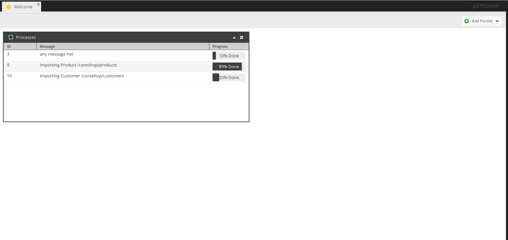
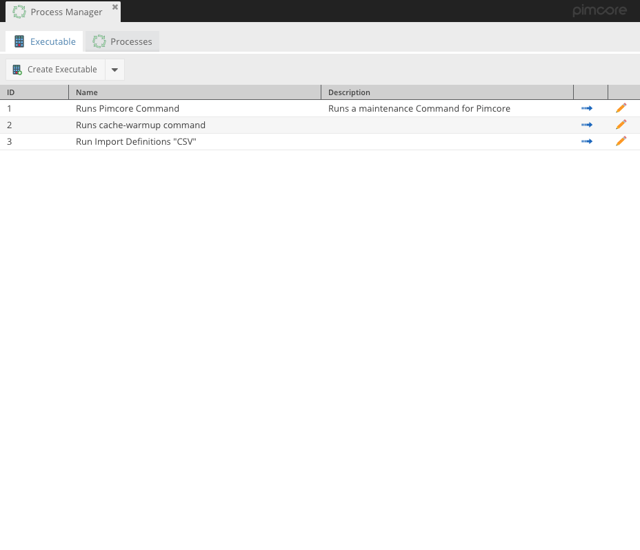
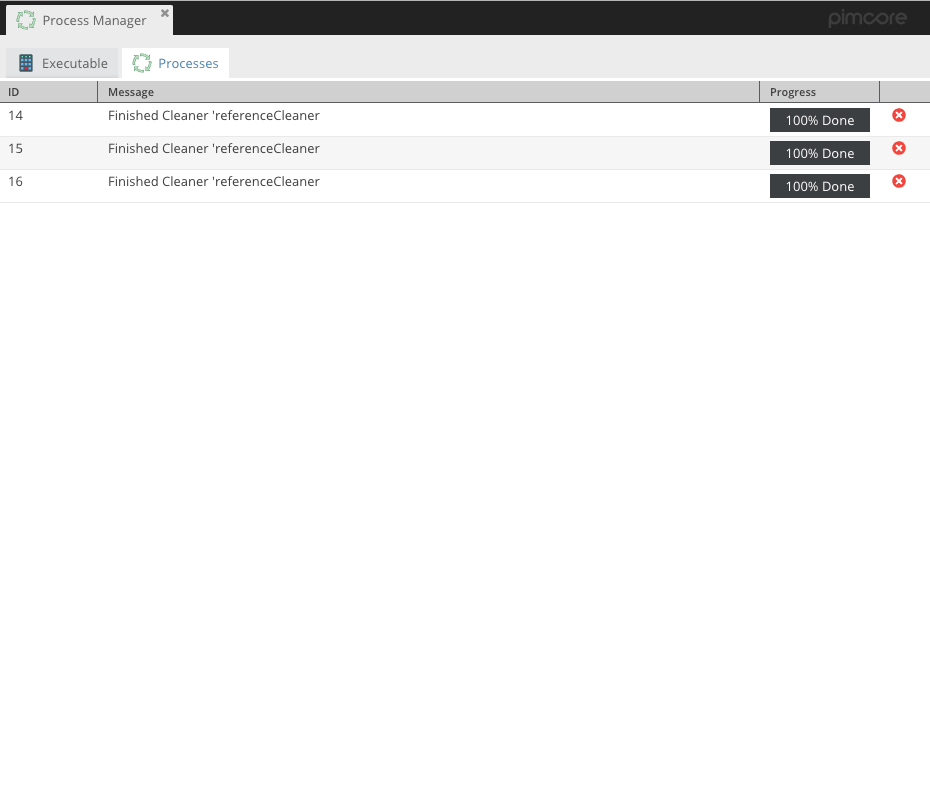

# Pimcore - Process Manager

**Looking for the current stable (version 1)? See https://github.com/dpfaffenbauer/ProcessManager/tree/1.1**

## Requirements
 - Pimcore 5

[](LICENSE.md)

Process Manager Plugin keeps track of all your "long running jobs". It adds a nive GUI and a new portlet for your Dashboard. You can also create Executables and run them with one click. (It's planned to integrate a CRON like Syntax for recurring tasks)

## Plugins using Process Manager

 - [ImportDefinitions](https://github.com/w-vision/ImportDefinitions)

## Getting started
 * Since Process Manager depends on CoreShops ResourceBundle, and the ResourceBundle only exists in DEV yet, you need to set your "minimum-stability" to "dev" in your composer.json
 * Install via composer ```composer require dpfaffenbauer/process-manager:2.0```
 * Enable via command-line (or inside the pimcore extension manager): ```bin/console pimcore:bundle:enable ProcessManagerBundle```
 * Install via command-line (or inside the pimcore extension manager): ```bin/console pimcore:bundle:install ProcessManagerBundle```
 * Reload Pimcore
 * Open Tools -> Process Manager

## Integrate to your Task

### Create new Process

```php

$process = $container->get('process_manager.factory.process')->createNew();
$process->setName('Task Name');         //Name of your Task
$process->setTotal(100);                //Total steps of your Task
$process->setMessage('Loading');        //Message
$process->setProgress(0);               //Initial Progress
$process->save();                       //Save
```

### Advance the Progress

```php
$process->progress();
$process->save();
```

### Finish the Progress

```php
$process->delete();
```

## Add a new Process Type
 * Add a new Class to your Bundle and implement ``ProcessManagerBundle\Process\ProcessInterface``` Interface
 * Add a new Form Type to your Bundle and add required fields to it
 * Add a new Service with tag ```process_manager.process```
  ```yml
        import_definition.process_manager.process:
            class: Wvision\Bundle\ImportDefinitionsBundle\ProcessManager\ImportDefinitionProcess
            tags:
            - { name: 'process_manager.process', type: 'importdefinition', form-type: 'Wvision\Bundle\ImportDefinitionsBundle\Form\Type\ProcessManager\ImportDefinitionsType' }
  ```
 * Thats it, done. (You still need to handle Process creation within your Bundle yourself, there is no magic behind it)


## Copyright and license 
Copyright: [lineofcode.at](http://www.lineofcode.at)
For licensing details please visit [LICENSE.md](LICENSE.md)



